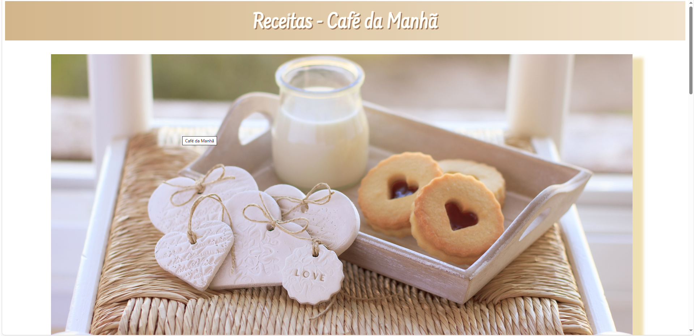
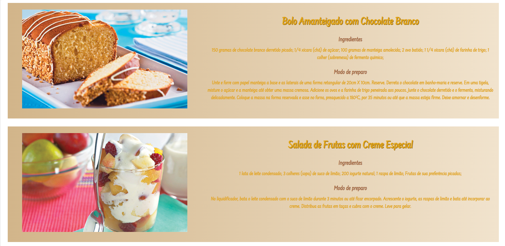
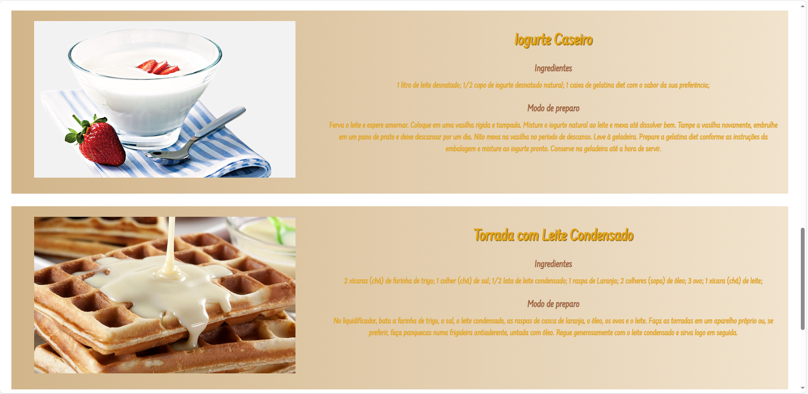
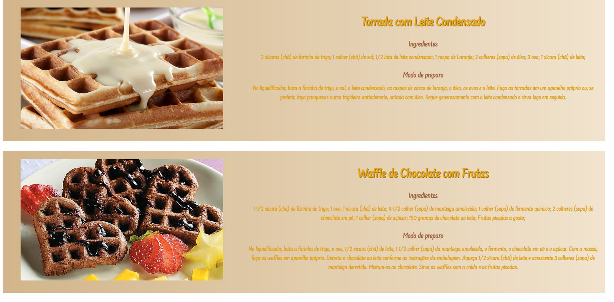

# atividade-CSS-Responsivo-Bolos
uma prova de CSS de fim de bimestre há muito tempo em 2023.
 

  <h3>Página de CSS para a prova. Eu perdi a programação da responsividade, então um dia eu refaço.</h3>
       

